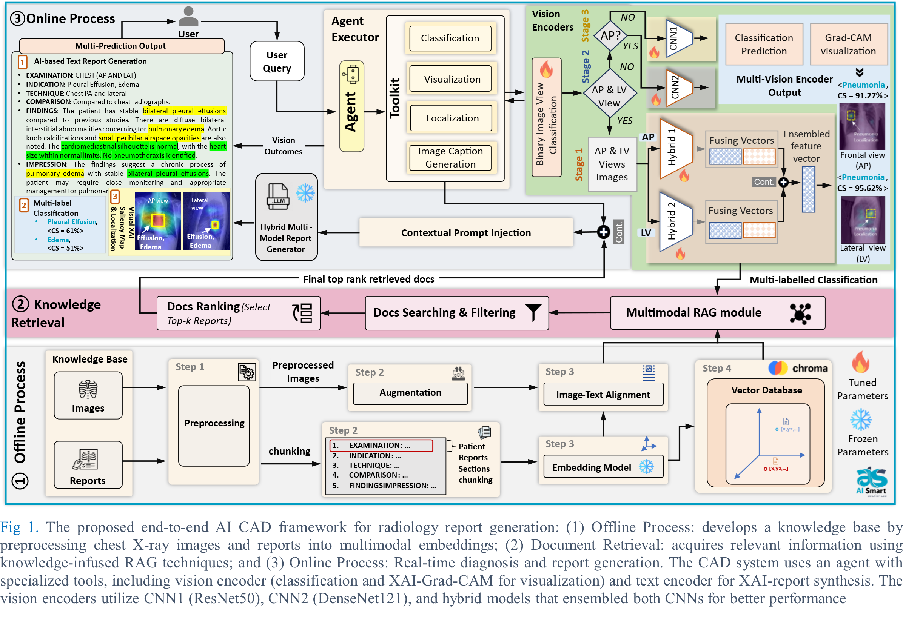
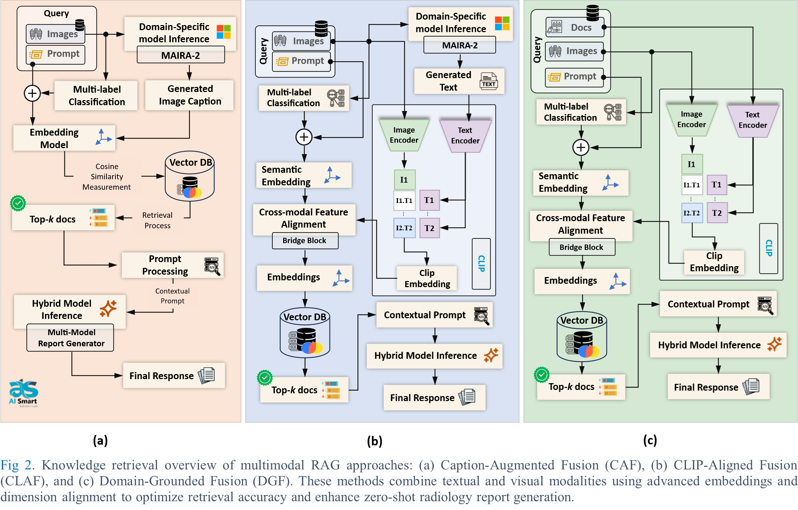

# 🩻 MEDXRAY-CAD: Multimodal Agentic Chest X-Ray Diagnosis

> **News:** This paper has been published in the **IEEE Journal of Biomedical and Health Informatics (JBHI)**.  
> 📄 **[Read the Paper here](https://ieeexplore.ieee.org/document/11297148)**

> **A novel agentic AI framework for chest X-ray diagnosis combining multimodal retrieval-augmented generation (RAG), classification, and human-in-the-loop interpretability.**

---

  
  &nbsp; &nbsp;
  

## 🚀 Overview

**MEDXRAY-CAD** is an intelligent, multimodal agentic system designed for automated chest X-ray (CXR) diagnosis.  
It integrates **vision encoders**, **binary and multi-label classifiers**, and a **vector database (Chroma)** for context-aware medical retrieval.  
The framework also features a **Gradio-based dashboard** for real-time interaction, visualization, and report generation.

---

## 🎯 Purpose

To automate and enhance diagnostic decision-making in CXR analysis by:
- Combining **deep visual encoders** and **retrieval-based reasoning**.
- Leveraging **medical report embeddings** for contextual retrieval.
- Enabling **interactive exploration** of predictions and Grad-CAM visualizations.

---

## 🧩 Key Components

- **Binary & Multi-label Classifiers** → Detect conditions such as *Pleural Effusion*, *Pneumonia*, etc.  
- **Vector Database (Chroma)** → Efficient storage and querying of medical report embeddings.  
- **Agentic Workflow** → Incorporates localisation, visualisation tools etc.  
- **Interactive Dashboard (Gradio)** → Real-time predictions, retrievals, and clinician-style queries.  

---

## 📚 Citation
@article{MedXrayCAD2025,
  title={MEDXRAY-CAD: Multimodal Agentic Chest X-Ray Diagnosis},
  journal={IEEE Journal of Biomedical and Health Informatics},
  year={2025},
  url={[https://ieeexplore.ieee.org/document/11297148](https://ieeexplore.ieee.org/document/11297148)}
}

## 📚 Related Work
@inproceedings{Salem2025AutoSpineAI,
  title={AutoSpineAI: Lightweight Multimodal CAD Framework for Lumbar Spine MRI Assessments},
  author={Salem, S. and Habib, A. and Raza, M. and Al-Huda, Z. and Al-maqtari, O. and Ertuğrul, B. and others},
  booktitle={IEEE-EMBS International Conference on Biomedical and Health Informatics},
  year={2025}
}

@article{AlAntari2025Evaluating,
  title={Evaluating AI-powered predictive solutions for MRI in lumbar spinal stenosis: a systematic review},
  author={Al-Antari, M. A. and Salem, S. and Raza, M. and Elbadawy, A. S. and Bütün, E. and Aydin, A. A. and others},
  journal={Artificial Intelligence Review},
  volume={58},
  number={8},
  pages={221},
  year={2025},
  publisher={Springer}
}

@inproceedings{Raza2025MedXpert,
  title={MedXpert-CAD: A Multimodal Multi-agentic System for Clinical Imaging Analysis via Model Context Protocol LLM-Driven Agentic Workflows},
  author={Raza, M. and Salem, S. and Habib, A. and Abdulmahmod, O. and Kwon, H. and Hussain, J. and Al-antari, M. A.},
  booktitle={International Workshop on Agentic AI for Medicine},
  pages={55--64},
  year={2025},
  month={September},
  publisher={Springer Nature Switzerland}
}
