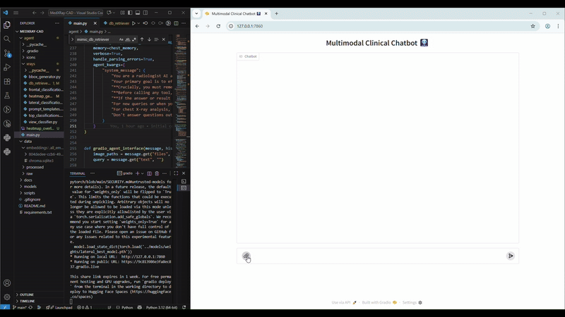

# 🩻 MEDXRAY-CAD: Multimodal Agentic Chest X-Ray Diagnosis

> **A novel agentic AI framework for chest X-ray diagnosis combining multimodal retrieval-augmented generation (RAG), classification, and human-in-the-loop interpretability.**

---


## 🚀 Overview

**MEDXRAY-CAD** is an intelligent, multimodal agentic system designed for automated chest X-ray (CXR) diagnosis.  
It integrates **vision encoders**, **binary and multi-label classifiers**, and a **vector database (Chroma)** for context-aware medical retrieval.  
The framework also features a **Gradio-based dashboard** for real-time interaction, visualization, and report generation.

---

## 🎯 Purpose

To automate and enhance diagnostic decision-making in CXR analysis by:
- Combining **deep visual encoders** and **retrieval-based reasoning**.
- Leveraging **medical report embeddings** for contextual retrieval.
- Enabling **interactive exploration** of predictions and Grad-CAM visualizations.

---

## 🧩 Key Components

- **Binary & Multi-label Classifiers** → Detect conditions such as *Pleural Effusion*, *Pneumonia*, etc.  
- **Vector Database (Chroma)** → Efficient storage and querying of medical report embeddings.  
- **Agentic Workflow** → Incorporates localisation, visualisation tools etc.  
- **Interactive Dashboard (Gradio)** → Real-time predictions, retrievals, and clinician-style queries.  

---

## 🛠️ Installation

### 1️⃣ Clone the Repository
```bash
git clone https://github.com/AISSLab2025/MedXRay-CAD.git
cd MedXRay-CAD


